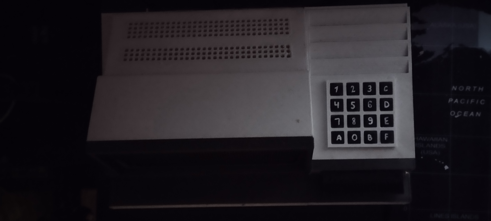
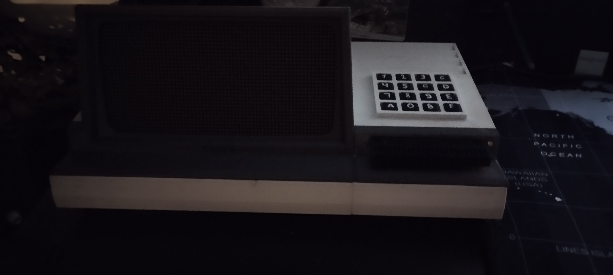
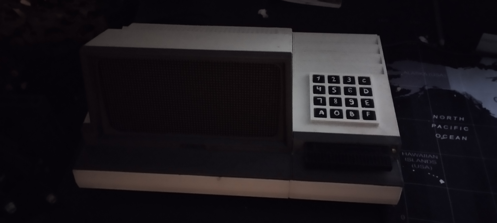

# CHIP8 Machine

## Info:

The CHIP8 Machine is a modern recreation of a vintage 8-bit virtual machine designed to play classic CHIP8 games. Originally developed in the 1970s, CHIP8 was a simple, yet powerful, programming environment that allowed developers to create games and programs with minimal hardware requirements. This project brings the CHIP8 experience to life by building a physical device that runs these vintage games on a custom-made machine, complete with a tactile keyboard, LED display, and an SD card for game storage.

The CHIP8 Machine is perfect for enthusiasts of retro computing and gaming, as well as those interested in DIY electronics projects. It provides a hands-on way to explore the origins of digital entertainment while learning about hardware assembly, 3D printing, and embedded programming.

## Overview:

This guide provides detailed instructions on how to build and set up a CHIP8 machine, including the parts needed, 3D printing instructions, wiring, and software installation.






<br>


## Documentation:

### Parts List:

You'll need the following components to build the CHIP8 machine:

| Part                                      | Quantity | Link                                                                                          |
|-------------------------------------------|----------|-----------------------------------------------------------------------------------------------|
| 5V 4A power supply                        | 1        | [Link](https://botland.store/socket-power-supply/8850-power-supply-5v-4a-dc-55-25-plug-5903351242530.html) |
| 12x12mm tact switch with cap              | 16       | [Link](https://botland.store/tact-switch/11138-tact-switch-12x12mm-cap-black-5-pieces-5904422307530.html) |
| Micro SD card reader                      | 1        | [Link](https://botland.store/memory-cards-accessories/8230-micro-sd-card-reader-module-5904422311278.html) |
| 3mm yellow LED                            | 1        | [Link](https://botland.store/leds/19988-led-3mm-yellow-10pcs-justpi-5904422328764.html)        |
| 3mm red LED                               | 1        | [Link](https://botland.store/leds/19989-led-3mm-red-10pcs-justpi-5904422328771.html)           |
| 64x32px 2.5mm Waveshare matrix display    | 1        | [Link](https://www.waveshare.com/rgb-matrix-p2.5-64x32.htm)                                   |
| Arduino Mega 2560                         | 1        | [Link](https://botland.store/arduino-compatible-boards-dfrobot/2685-dfrobot-mega-2560-v32-compatible-with-arduino-6959420922345.html) |
| Arduino Uno                               | 1        | [Link](https://botland.store/arduino-basic-boards/1060-arduino-uno-rev3-module-a000066-7630049200050.html) |
| 5mm power switch                          | 1        |                                                                                               |

**Additional Tools & Materials:**

- Wires
- Soldering tools
- Polishing papers
- Clips
- Screwdriver
- Nail polish remover (optional, for fitting parts)

### Printing & Assembly:

1. **3D Printing:**

   - Find the print files in the `3D/stl` directory.
   - Print the following parts:

    | File               | Color | Quantity |
    |--------------------|-------|----------|
    | display_cover.stl  | Gray  | 1        |
    | keyboard_cover.stl | Gray  | 1        |
    | screw_2x.stl       | Gray  | 2        |
    | screw_4x.stl       | Gray  | 4        |
    | display_mount.stl  | White | 1        |
    | keyboard_mount.stl | White | 1        |
    | keyboard_holder.stl| White | 1        |
    | bottom.stl         | White | 1        |
    | bottom_right.stl   | White | 1        |
    | joiner_3mm_2x.stl  | White | 2        |
    | joiner_5mm_2x.stl  | White | 2        |
    | cartridge.stl      | Black | 1 or more|

    **Required Filament:**

    - White: 0.7 kg
    - Gray: 0.2 kg
    - Black: 0.05 kg

2. **Assembly:**

   - Use the `3D/mode/chip8.blend` file in Blender to visualize the assembly process.
   - Assemble the printed parts (use polishing paper, tools, and nail polish remover for better fitting).
   - Apply a protective coat or paint if desired.
   - Use 4x mm bolts to mount the bottom part with the top parts.
   - Insert the 16x 12x12mm tact switches into the `keyboard_mount.stl` part (use glue to secure them tightly).
   - Place the 3mm yellow LED in the upper hole and the 3mm red LED in the lower hole of `keyboard_mount.stl` (use glue).
   - Insert an OTG USB cable into the cartridge hole in `keyboard_mount.stl` (use glue).
   - Mount the 64x32px RGB matrix display into the `display_mount.stl` (use glue to secure it tightly).
   - Place the SD card reader inside the `cartridge.stl`.
   - Print labels on standard paper and glue them onto the tact switch caps using the following layout:

     | | | | |
     |-|-|-|-|
     |1|2|3|C|
     |4|5|6|D|
     |7|8|9|E|
     |A|0|B|F|

### Wiring:

1. **Arduino Mega Connections:**

    | Pin | Connected To   |
    |-----|----------------|
    | rx3 | Arduino Uno tx  |
    | tx3 | Arduino Uno rx  |
    | A0  | Matrix-A        |
    | A1  | Matrix-B        |
    | A2  | Matrix-C        |
    | A3  | Matrix-D        |
    | 9   | Matrix-OE       |
    | 10  | Matrix-LAT      |
    | 11  | Matrix-CLK      |
    | 24  | Matrix-R1       |
    | 25  | Matrix-G1       |
    | 26  | Matrix-B1       |
    | 27  | Matrix-R2       |
    | 28  | Matrix-G2       |
    | 29  | Matrix-B2       |
    | 32  | Buzzer-sig      |
    | 34  | Power LED+      |
    | 35  | Signal LED+     |
    | 42  | C1              |
    | 43  | C2              |
    | 44  | C3              |
    | 45  | C4              |
    | 48  | R1              |
    | 49  | R2              |
    | 50  | R3              |
    | 51  | R4              |
    | 5V  | Buzzer 5V, Arduino Uno 5V  |
    | GND | Power LED-, Signal LED-, Buzzer GND, Matrix GND1-5, Arduino Uno GND |

2. **Arduino Uno Connections:**

    | Pin | Connected To   |
    |-----|----------------|
    | 5V  | Reader-5V      |
    | GND | Reader-GND     |
    | 10  | Reader-CS      |
    | 11  | Reader-MOSI    |
    | 12  | Reader-MISO    |
    | 13  | Reader-SCK     |
    | tx  | Arduino Mega rx|
    | rx  | Arduino Mega tx|

3. **Other Connections:**

    - Insert the Arduino Mega and Arduino Uno into the `bottom.stl` part.
    - Insert the 5V 4A power supply through the first hole in the `bottom.stl` part.
    - Insert the power switch through the second hole in the `bottom.stl` part.

### Software Installation:

1. **Preparing the SD Card:**

   - Format the SD card to the FAT file system and ensure its label is "chip8". If you want to use a different label, update the name in the `runtime/runtime.py` file.
   - Copy the CHIP8 ROMs you want to use onto the SD card (sample ROMs can be found in the `samples` directory).
   - Ensure that only `.ch8` files are on the card (remove any system-generated files like `trash`, `volume info`, etc.).

2. **Cloning the Repository:**

   - Clone the repository:

     ```bash
     git clone git@github.com:wojlin/real-chip8.git
     ```

3. **Installing Arduino IDE:**

   - Download and install the Arduino IDE from [here](https://www.arduino.cc/en/software).

4. **Uploading the Code:**

   - Plug the machine into the 5V

 4A socket (ensure the power supply is turned on before connecting the USB cable).
   - Open `sd/sd.ino` in the Arduino IDE.
   - Upload `sd.ino` to the Arduino Uno.
   - Open `emulator/emulator.ino` in the Arduino IDE.
   - Upload `emulator.ino` to the Arduino Mega.
   - Unplug the USB cable, mount the bottom part of the machine with the top, and secure it with screws.

### Troubleshooting:

1. Ensure the SD card is formatted to FAT.
2. Verify that the SD card name is "chip8".
3. Check that the files on the SD card are in DOS 8.3 format.
