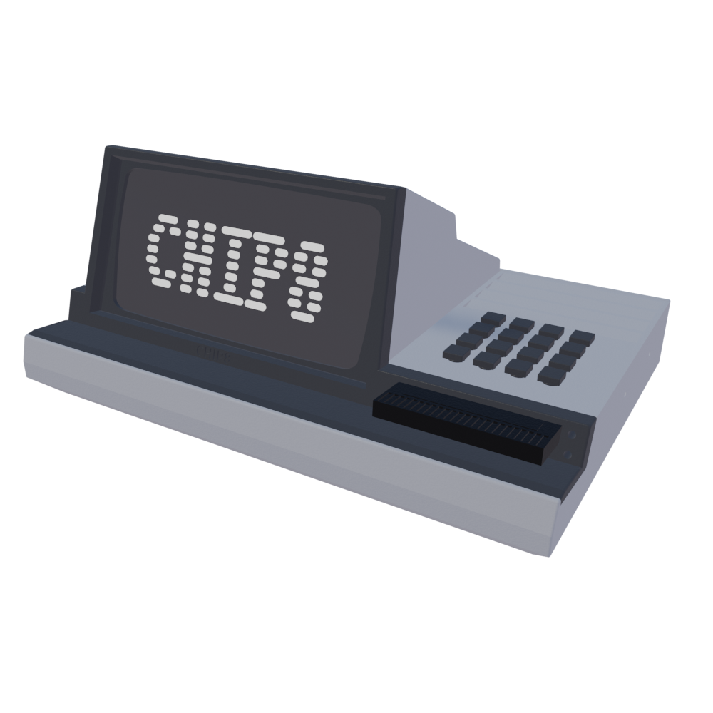
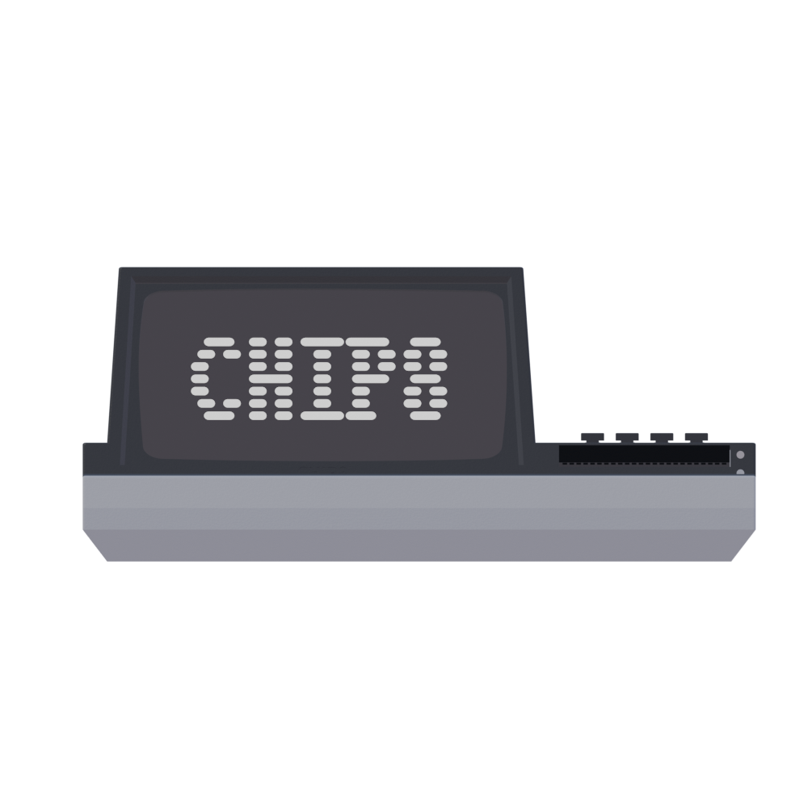
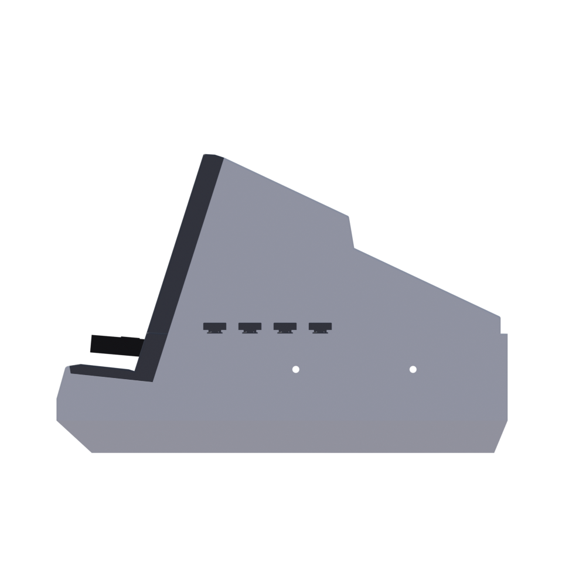
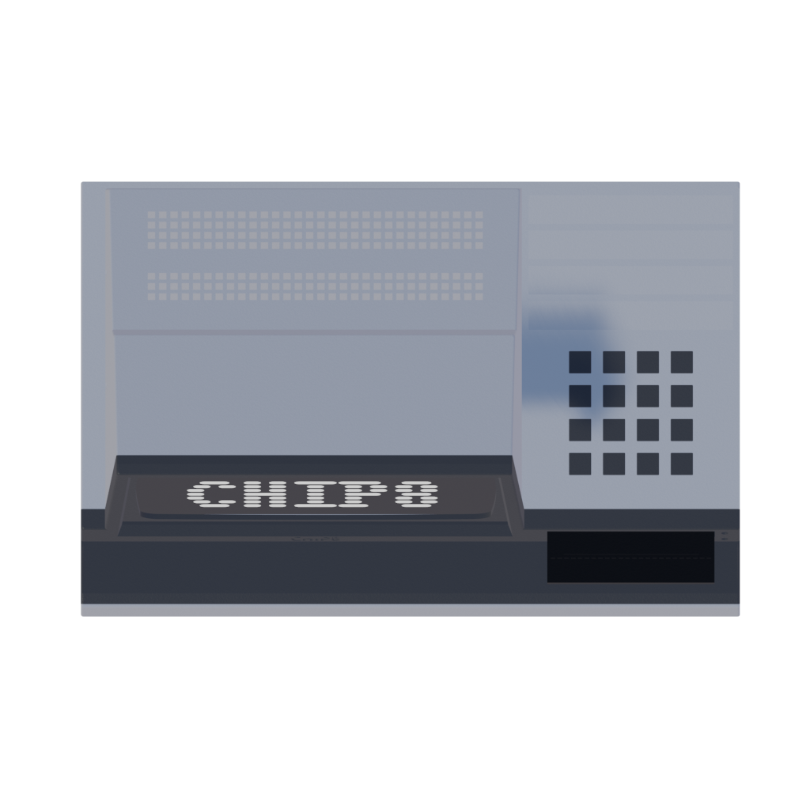

# CHIP8 Machine

## About:




<br>



## Documentation:


## How To Build:

0. Parts needed

    |                 Part                   | Amount | Link |
    |----------------------------------------|--------|--------|
    | 5V 4A power supply                     | 1x     | [link](https://botland.store/socket-power-supply/8850-power-supply-5v-4a-dc-55-25-plug-5903351242530.html) |
    | tact switch with cap                   | 12x    | [link](https://botland.store/tact-switch/11138-tact-switch-12x12mm-cap-black-5-pieces-5904422307530.html)
    | otg cable                              | 1x     | [link](https://botland.store/usb-20-cables/3998-cable-goobay-otg-host-micro-usb-02m-4040849951947.html)
    | yellow 3mm led                         | 1x     | [link](https://botland.store/leds/19988-led-3mm-yellow-10pcs-justpi-5904422328764.html)
    | red 3mm led                            | 1x     | [link](https://botland.store/leds/19989-led-3mm-red-10pcs-justpi-5904422328771.html)
    | 64x32px 2.5mm waveshare matrix display | 1x     | [link](https://www.waveshare.com/rgb-matrix-p2.5-64x32.htm)

    you will also need some wires, soldering tools, polishing papers, clips, screwdriver to asseble this machine

1. Printing & assembly

    - find print files in 3D/stl directory
    - print all the files:

        |        File        | Color | Amount |
        |--------------------|-------|--------|
        | display_cover.stl  | gray  | 1x     |
        | keyboard_cover.stl | gray  | 1x     |
        | screw_2x.stl       | gray  | 2x     |
        | screw_4x.stl       | gray  | 4x     |
        | display_mount.stl  | white | 1x     |
        | keyboard_mount.stl | white | 1x     |
        | bottom.stl         | white | 1x     |
        | bottom_right.stl   | white | 1x     |
        | joiner_3mm_2x.stl  | white | 2x     |
        | joiner_5mm_2x.stl  | white | 2x     |
        | cartridge.stl      | black | min 1  |

        you will need and least:

        - 0.7kg of white filament
        - 0.2kg of gray filament
        - 0.05kg of black filament

    - launch 3D/mode/chip8.blend file using blender to see how it should be assembled
    - assemble parts (you may need to use polishing paper, tools and nail polish remover to make parts fit nicely)
    - apply coat or paint if neeeded
    - to mount bottom with the top parts use 4x mm bolts
    - place 16x 12x12mm tact switches into "keyboard_mount.stl" (use glue to fix them tight)
    - place yellow 3mm led on higher hole into "keyboard_mount.stl" (use glue)
    - place green 3mm led on lower hole into "keyboard_mount.stl" (use glue)
    - insert otg usb cable into cartidge hole into "keyboard_mount.stl" (use glue)
    - place 64x32px rgb matrix display into "display_mount.stl" (use glue to fix it tight)
    - place a usb drive inside of "cartridge.stl"
    - print lables on normal printer and glue then on tact switches caps in this layout:

        | | | | |
        |-|-|-|-|
        |1|2|3|C|
        |4|5|6|D|
        |7|8|9|E|
        |A|0|B|F|


2. Wiring

    - insert raspberry pi zero into "bottom.stl" part
    - insert 5v 4A power supply trough hole in "bottom.stl" part
    - connect tact switches to rpi using diagram below:
    - connect leds to rpi using diagram below
    - connect display to rpi using diagram below

    ```
    - d means display
    - g means green led
    - y means yellow led
    ```

    |   Connection   | Pin | Pin | Connection  |
    | -------------- | --- | --- | ----------- |
    | -              | 1   | 2   | POWER +     |
    | y +            | 3   | 4   | -           |
    | g +            | 5   | 6   | d GND       |
    | d LAT/STB      | 7   | 8   | -           |
    | g,y GND        | 9   | 10  | d E         |
    | d CLK          | 11  | 12  | d OE-       |
    | d G1           | 13  | 14  | -           |
    | d A            | 15  | 16  | d B         |
    | -              | 17  | 18  | d C         |
    | d B2           | 19  | 20  | -           |
    | d G2           | 21  | 22  | d D         |
    | d R1           | 23  | 24  | d R2        |
    | -              | 25  | 26  | d B1        |
    | -              | 27  | 28  | -           |
    | - +            | 29  | 30  | -           |
    | - +            | 31  | 32  | -           |
    | - +            | 33  | 34  | -           |
    | - +            | 35  | 36  | - +         |
    | - +            | 37  | 38  | - +         |
    | -              | 39  | 40  | - +         |

3. Installing software

    - use your pc to format the usb drive placed in cartidge to FAT extension and make sure that label of that drive is "chip8"(if you want other name you will need to change it inside of runtime/runtime.py file)

    - copy the chip8 roms that you want inside of that usb drive. (you can find rom samples in the samples directory)

    - make sure that only ch8 files are in the drive (remove the trash diretory volumine info etc)

    - install raspian on your rpi

    - enable ssh or any method of communication with your rpi cause from now on all of the commends are need to be typed on your rpi

    - clone this repo:

        ```bash
        git clone git@github.com:wojlin/real-chip8.git
        ```

    - move to repo directory:

        ```bash
        cd real-chip8
        ```

    - update submodules

        ```bash
        git submodule add -f git@github.com:hzeller/rpi-rgb
        git submodule init
        git submodule update
        ```

    - move to submodule python bindings

        ```bash
        cd rpi-rgb-led-matrix/bindings/python
        ```

    - install dependencies

        ```bash
        sudo apt-get update && sudo apt-get install python3-dev cython3 -y
        ```

    - install rgb matrix lib for python

        ```bash
        make build-python 
        sudo make install-python 
        ```

    - move to runtime directory:

        ```bash
        cd runtime
        ```

    - install all python dependencies:

        ```bash
        sudo pip install -r requirements. txt
        pip install -r requirements. txt
        ```

    - execute the setup.sh script using sudo priviliages: 
    (this will add the python script to autostart so on evry turn on the computer will wait for an chip8 rom to be isntrted and start the emulator)
    
        ```bash
        sudo setup.sh
        ```

    - go back to repo directory:

        ```bash
        cd ../
        ```

    - go to emulator directory:

        ```bash
        cd emulator
        ```

    - build emulator using cmake:

        ```bash
        mkdir build
        cd build
        cmake ..
        cmake --build .
        ```

    - now reboot your rpi

    - after rpi reboot if you place your cartidge into cartidge hole the chip8 emulator shuld run automaticly and display your chip8 rom

## Troubleshooting:

1. check if cartidge drive is formated to FAT
2. check if cartridge name is "chip8"
3. check logs in the runtime/runtime.log
    - if autostart is setup correctly each time you plug the rpi to power, the runtime.py shuld be runned at autostart and it will procuce log "runtime started". if you dont see this message in logs that means that your runtime.py is not added correctly to rpi autostart service
    - if autostart works and you placed cartidge but notthing happends look for "detected desired drive" in logs. that means that runtime detected the valid drive
    - after that a log with filenames should appear. if no that means that probably your files are corrupted or have bad extension. chip8 rom shuld have ".ch8" extension
4. send the logs to me at wojciech.linowski.2137@gmail.com and i will try to help